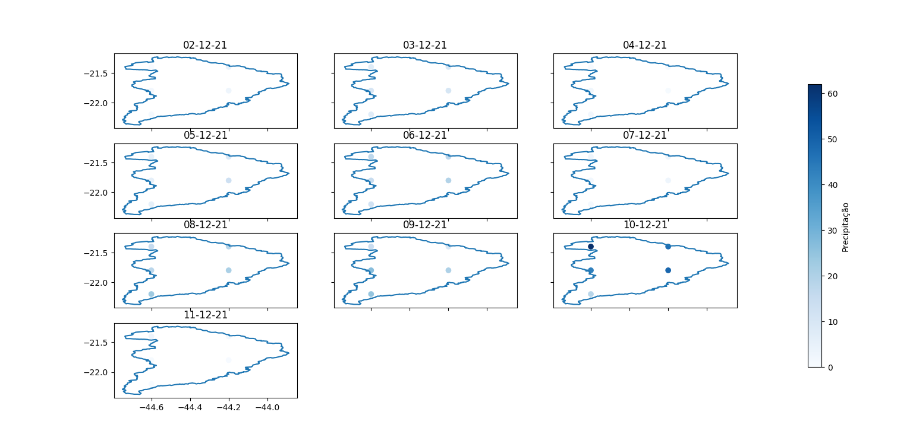
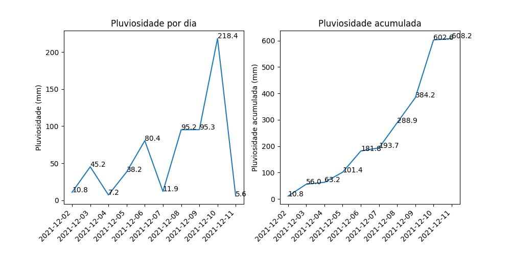

# BTG Energy Challenge
### Introdução
Trabalhando nos sistema da mesa de Energia do banco BTG Pactual, constantemente lidamos com dados de precipitação, tanto previsto como observado. 
A informação de quanto choveu ou quanto choverá em determinado lugar é dada por uma malha de coordenadas 
(latitude [lat] e longitude [long]) e uma terceira variável que é a precipitação diária acumulada naquele ponto.

Na pasta `forecast_files` é possivel encontrar a previsão de precipitação do modelo meteorológico ETA, desenvolvido pelo INPE.
O nome dos arquivos seguem o seguinte padrão: ETA40_p011221a021221.dat -> ETA40_p**ddmmyy**a**ddmmyy**.dat. 
Em que a primeira data é referente a quando foi feita a previsão e a segunda data diz respeito qual data está sendo prevista.

Dentro do arquivo, os dados seguem o descrito acima:
```
lat     long    data_value
-75.00  -35.00  0.0
-75.00  -34.60  0.1
-75.00  -34.20  0.0
```

Porém, estes dados não são utilizados desta forma, eles passam por um processamento. Pois, uma das perguntas que queremos
responder no nosso dia a dia é: **Quanto choveu ou choverá em determinada região do Brasil?**. 

Para isso, utilizamos um **contorno**, que é um polígono consistido das coordenadas que delimitam uma região. 
Assim, conseguimos "recortar" os dados que caem dentro desta região e calcular, por exemplo, a precipitação média da região.

Por exemplo (valores inventados):
```
forecast_date   forecasted_date     data_value
01/12/2021      02/12/2021          1.4
01/12/2021      03/12/2021          2.1
...             ...                 ...
01/12/2021      07/12/2021          3.2
```


### O desafio
O desafio consiste em responder a seguinte pergunta: **Qual é a previsão de precipitação ACUMULADA dada pelo modelo ETA no dia 01/12/2021 para a região de escoamento da usina Hidrelétrica Camargos (bacia do rio Grande)?**

![Contorno de Camargos [Grande]](Contour_Camargos_Grande.png "Contorno de Carmargos")

Modifique o arquivo `main.py` para fazer o "recorte" dos dados de precipitação (para **todos** os dias previstos pelo modelo) e 
apresente graficamente a resposta para a pergunta.


### Resalvas
- É permitido a utilização de bibliotecas extras
- A entrega do desafio deve ser feita por GIT. Responda o email com o link do seu repositório.

### Execução
Para instalar as dependências do código:

```poetry install```

O código pode ser executado com 
```poetry run python main.py```

### Resultados
Pluviosidade por dia
| Dia                    | Pluviosidade (mm) |
|------------------------|-------------------|
| 2021-12-02             | 10.8              |
| 2021-12-03             | 45.2              |
| 2021-12-04             | 7.2               |
| 2021-12-05             | 38.2              |
| 2021-12-06             | 80.4              |
| 2021-12-07             | 11.9              |
| 2021-12-08             | 95.2              |
| 2021-12-09             | 95.3              |
| 2021-12-10             | 218.4             |
| 2021-12-11             | 5.6               |
| **Total Acumulado**    | 608.2             |


Pluviosidade por dia em cada ponto dentro da Bacia do Rio Grande


Gráficos de Pluviosidade por dia e acumulada
